# Eindproject - API Development

Voor dit project moesten we een API maken rond een zelf te kiezen thema. We konden zelf kiezen of we hetzelfde thema gebruikten als dat van het basisproject of genoow een nieuw gebruikten, ik heb gekozen om een nieuwe te gebruiken. De API moest ook via GitHub Actions automatisch op docker hub gepost worden na een push naar de GitHub repo, deze moest dan ook op okteto gedeployed worden. We moesten tenslotte ook nog hashing en OAuth toepassen.

# Thema

Het thema dat ik voor dit project heb gekozen zijn Off-Road Cars, omdat ik zelf wel veel interesse heb in auto's. En dan zeker van die grote SUV's of pick-up's met een zware moter die over met gemak doorheen kunnen rijden.

Deze API is dus gemaakt voor als je bijvoorbeeld een grote off-road auto dealer hebt, dan kun je in deze API al de auto's toevoegen en raadplegen die dat je verkoopt.

# API

De API is opgedeeld in 3 onderdelen: brands, models, owners. Voor elk onderdeel is er ook een tabel aangemaakt in de database.
Dit zijn alle requests die er zijn:

- GET Brand: Geeft alle brands in de database
- GET Brand ID: Geeft de brand die bij een bepaalde ID hoort
- GET Brand Name: Geeft de brand per name
- GET Model: Geeft alle models
- GET Model ID: Geeft het model die bij een bepaalde ID hoort
- GET Model Name: Geeft het model per name
- GET Model Year: Geeft het model per year
- GET Model Body Type: Geeft het model per body type
- GET Model Power: Geeft het model per power
- GET Model Brand ID: Geeft het model per ID van een merk

- POST Model: maakt een nieuw model aan
- POST Brand: maakt een nieuwe brand aan
- POST Owner: maakt een nieuwe owner aan
- POST Token: maakt een nieuw token aan

- DELETE Model: Verwijdert een model uit de database

# database.py

Hier wordt de database aangemaakt en wordt er ook een URL voor gemaakt zodat je met de database kunt verbinden. Er worden ook de bijhorende classes aangemaakt zoals de SessionLocal class en de Base class en er wordt ook een engine aangemaakt.

# models.py

Hier maak je de nodige classes, dit worden de SQLAlchemy models.
Dit zijn de classes die dat ik gebruik:

Zoals je ziet heb ik ook relaties toegevoegd:
Een brand kan meerdere models hebben, maar een model kan maar één brand hebben.
Een owner kan meerdere brands hebben, maar een brand kan maar één owner hebben.

# schemas.py

Hier maak ik de schemas aan voor de classes, dus ik zet hier eigenlijk hoe dat een nieuwe brand, model of owner aangemaakt moet worden door voor elk attribuut een base class, een create class en een class voor het attribuut zelf. Zoals je kan zien gebruik ik eigenlijk de create class alleen maar bij owner, dat doe ik omdat ja anders bij het oproepen van de owner class je ook gewoon z'n password kan zien. Dat vermijd ik door het password in de create class te zetten want dan komt deze alleen maar bij het maken van een nieuwe owner.

# crud.py

In de crud file maak ik alle nodige functies. Deze functies interageren met de gegevens in de database. Elke functie voegt oftewel nieuwe data toe, vraagt data aan in de db of verwijdert data van de database. Voor elke interactie met de database moet er een nieuwe session aangemaakt worden, omdat bij SQLlite elke session wordt afgesloten als de interactie gedaan is. Je maakt gebruik van de models gemaakt in de model.py file om de juiste gegevens mee te geven naar de database.

# main.py

In de main.py file komen alle requests te staan die je nodig hebt. Als eerste wordt er nagekeken of dat de database file te vinden is, daarna worden alle models (tabels in de database) aangemaakt. Vervolgens wordt de bearer token aangemaakt (zie bij "auth.py"),daarna komen de CORS: deze zorgen ervoor dat je resources van een ander domein gewoon op deze site kunt gebruiken. Ten slotte komen alle get, post en delete requests.

# auth.py

Hier maak ik eerst een secret key aan (ik heb deze uit de cursus moeten nemen omdat de installatie van het OpenSSL programma niet werkte bij mij). Daarna hash ik het ingevoerde password die dat je moet ingeven bij het aanmaken van een owner. De volgende functie vergelijkt het password met het gehashed password voor die gebruiker. De authenticatie functie kijkt eerst of dat de owner naam al in de database staat, zoja dan wordt het password gevraagd en wordt deze vergeleken met het gehashed password door de vorige functie te gebruiken. De laatste functie maakt een token aan en geeft bij deze token ook een expiring date mee, dit wordt ook elke keer nagekeken bij het gebruiken van deze functie of dat de token nog niet expired is.

# Aanvullingen

De aanvullingen die ik heb gedaan staan hieronder, ze zijn niet altijd helemaal gelukt
2.1 & 2.1.1
3.1 & 3.1.1 & 3.1.2

## Front-end

Ik heb een hele front-end gemaakt maar ik krijg mijn data niet op mijn webpagina. Ik weet echt niet hoe dit komt want ik heb wel voor elke request een variabele geïnitialiseerd en dan ook een functie gemaakt die dat de data van deze variabelen bijhoudt.

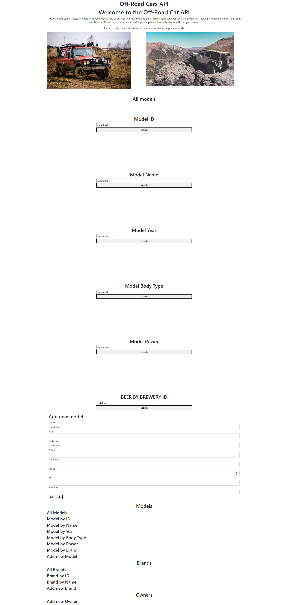

## Test

### test_main.py

Ik heb ook test file gemaakt, die dat al mijn get, post en delete requests test. Om bijvoorbeeld een get request te testen moet ik daar dan ook al de juiste gegevens bij geven en dit zorgt er dus voor dat hij alleen de request voor die gegevens test. Je kan dus zo heel veel verschillende test toevoegen voor dezelfde request maar dan wel altijd andere data invullen.
De tests voor al mijn GET request werken, maar die voor mijn post request werken spijtig genoeg niet.

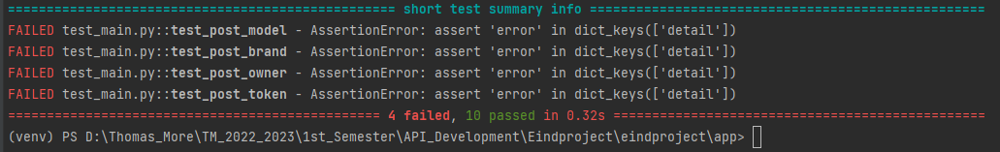

# Postman screenshots

## GET Requests

### GET Brands

### GET Brand by ID

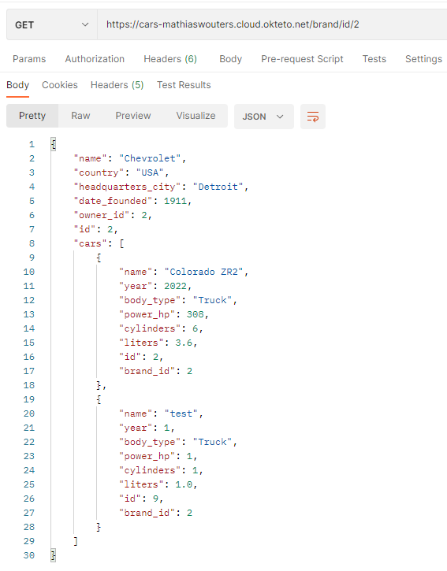

### GET Brand by Name

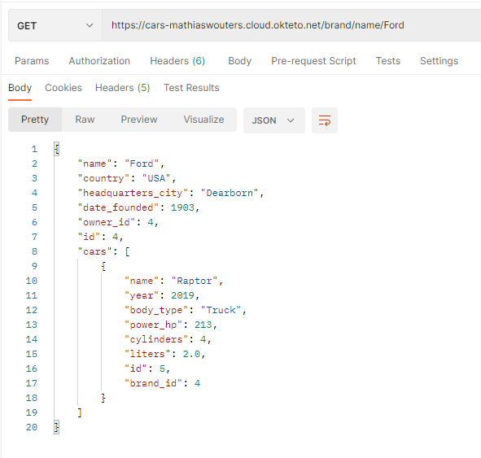

### GET Models

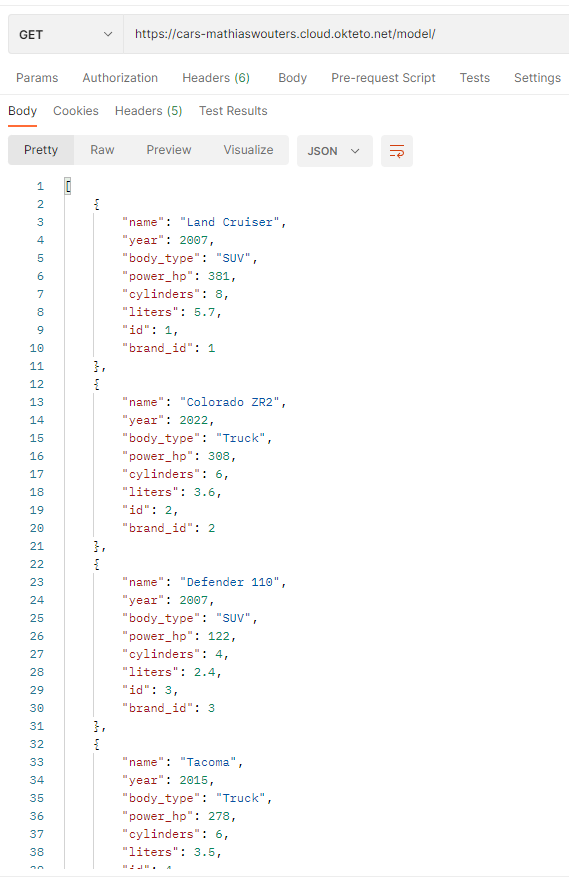

### GET Model by ID

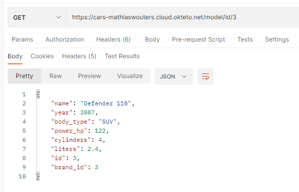

### GET Model by Name

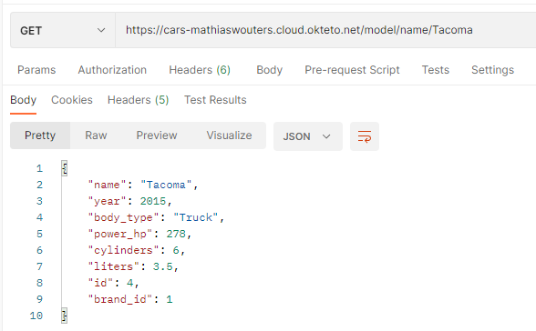

### GET Model by Year

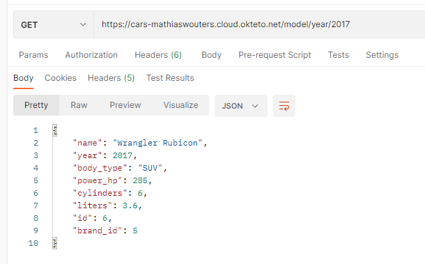

### GET Model by Body Type

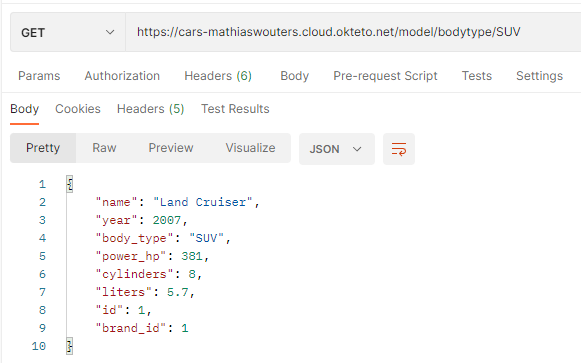

### GET Model by Power

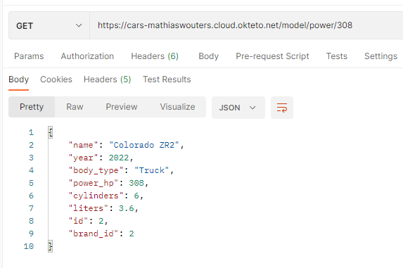

### GET Model by Brand ID

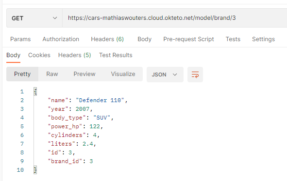

## POST Requests

### POST Model

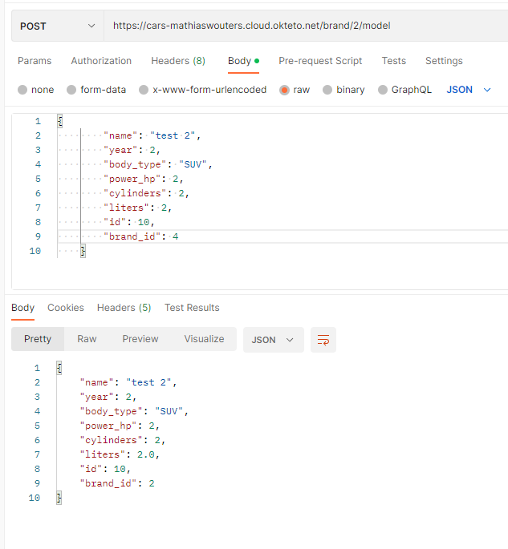

### POST Brand

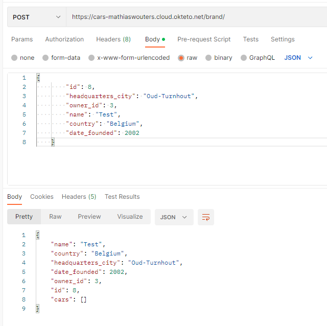

### POST Owner

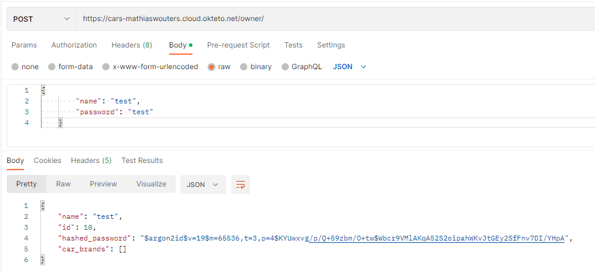

### POST Token

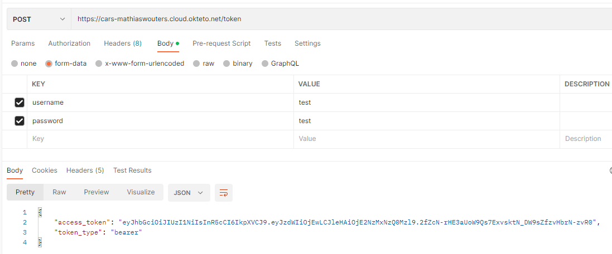

## DELETE Requests

### DELETE Model

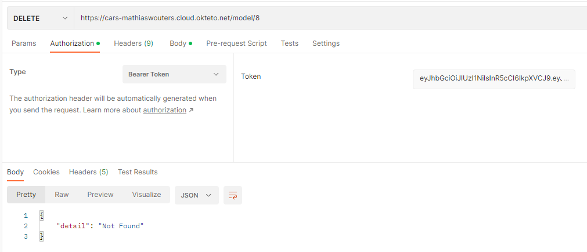

# OpenAPI docs screenshots

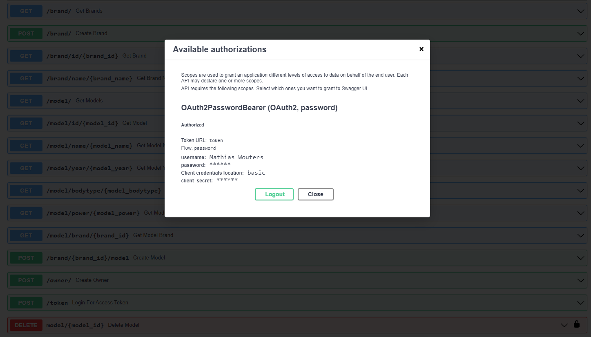

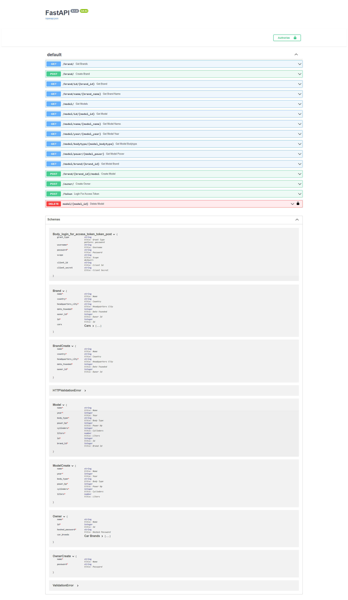

# Links

- Hosted API: [Hosted API link](https://cars-mathiaswouters.cloud.okteto.net/)
- Front-end repo: [Front-end repo link](https://github.com/mathiaswouters/api-eindproject-frontend)
- Hosted front-end: [Hosted front-end link](https://api-eindproject-mathias-wouters.netlify.app/)
